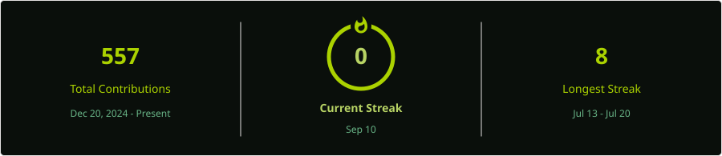

# 🏛️ .Github Repo

> Welcome! This repository acts as the **global default configuration hub** for my GitHub account. 

Settings, templates, and automated workflows stored here are automatically applied across all public repositories under this profile to maintain consistency and developer productivity.

---

### 🛠️ What's Inside This Control Hub?

* ⚙️ **Global Workflows (`.github/workflows/`)**: Automated CI/CD pipelines, including dynamic SVG metrics and streak stat generators.
* 📋 **Issue & PR Templates (`.github/ISSUE_TEMPLATE/`)**: Standardized bug report and feature request formats for smooth collaboration.
* 💳 **Sponsorship Configuration (`.github/FUNDING.yml`)**: Unified Ko-fi integration providing the "Sponsor" button across all projects.
* 🛡️ **Community Health**: Default security policies, contribution guidelines, and code of conduct.

---

### 📊 Account Dynamic Dashboard

  

---

### ☕ Support My Work

If you find my open-source projects, algorithms, or automated tools useful, feel free to buy me a coffee!

---
*Maintained by [@Hajime-No-Ippo](https://github.com/Hajime-No-Ippo)*
